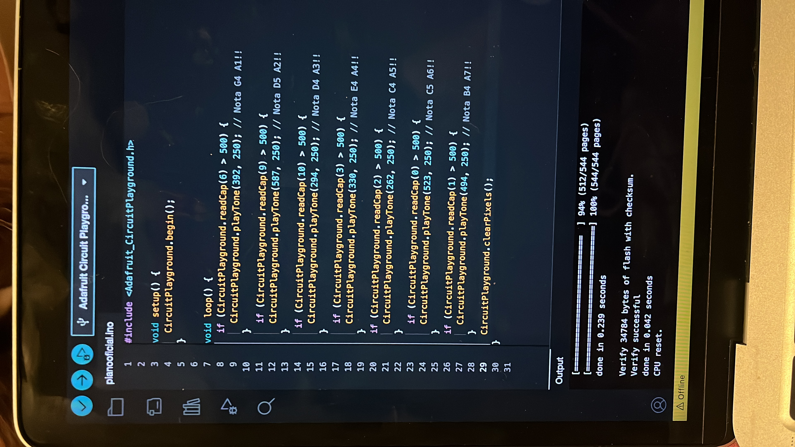
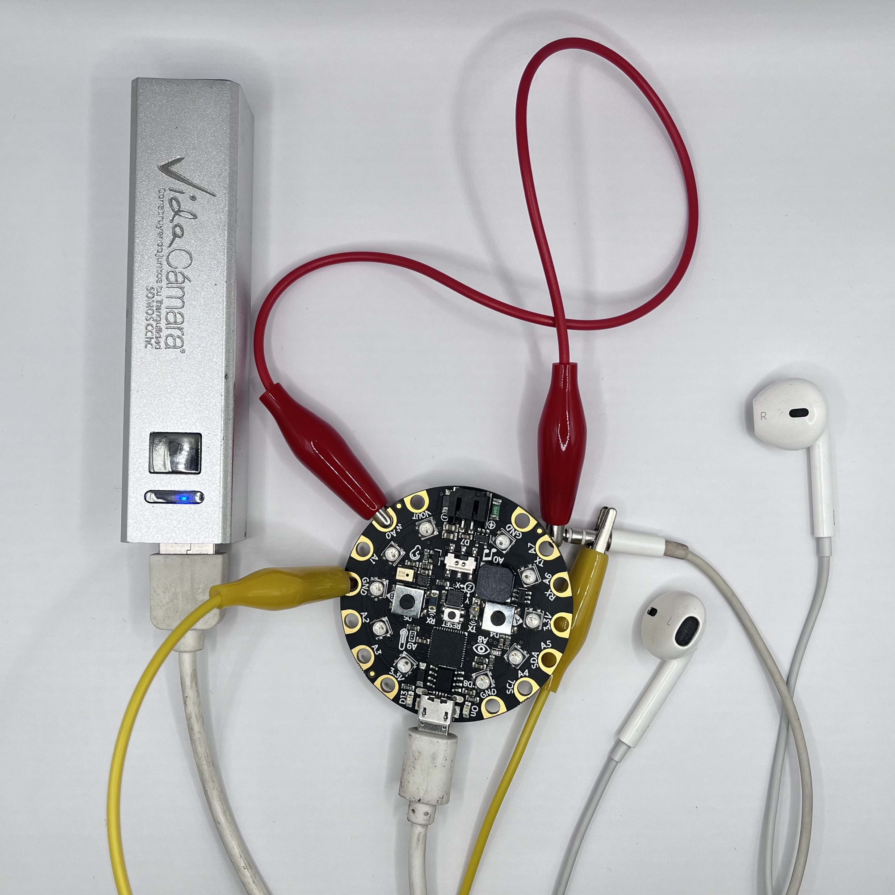
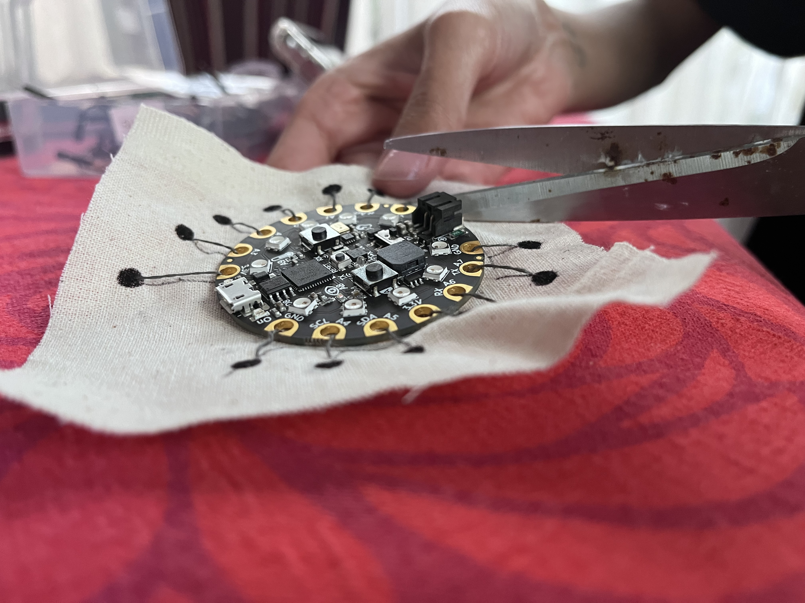

# examen grupo-01

## integrantes

* cooper manzor, valentina
* frías gonzález, aranza ignacia
* huerta galdames, sofía paz

## descripción

Un instrumento portable en una cangurera, la idea es inducir a la relajación, a tener una experiencia emocional y sensorial en el usuario.

## imágenes

## código