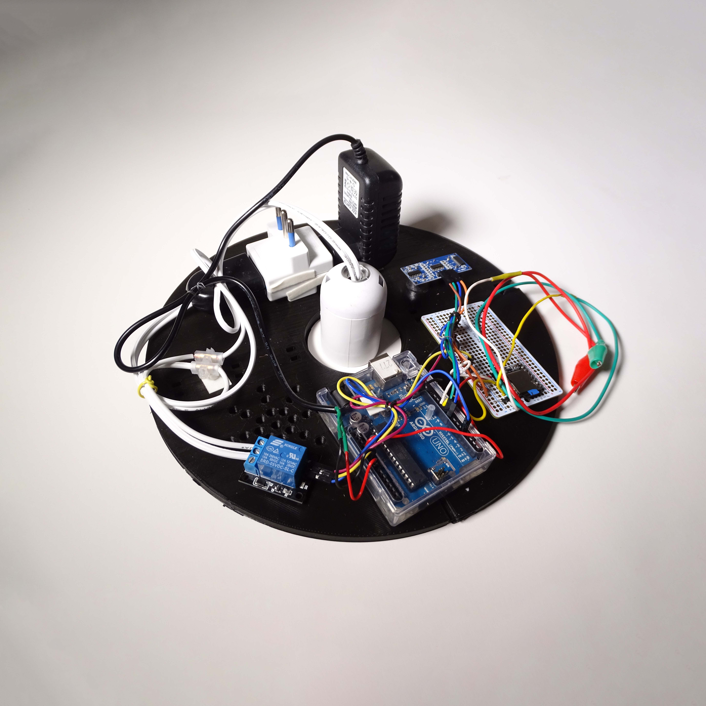
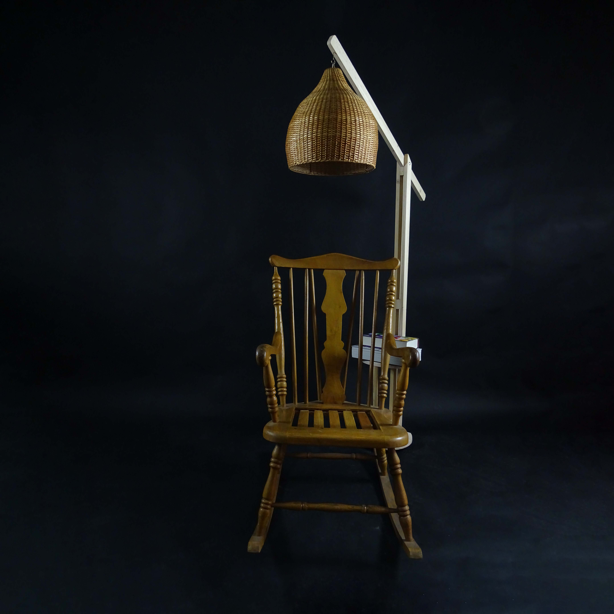
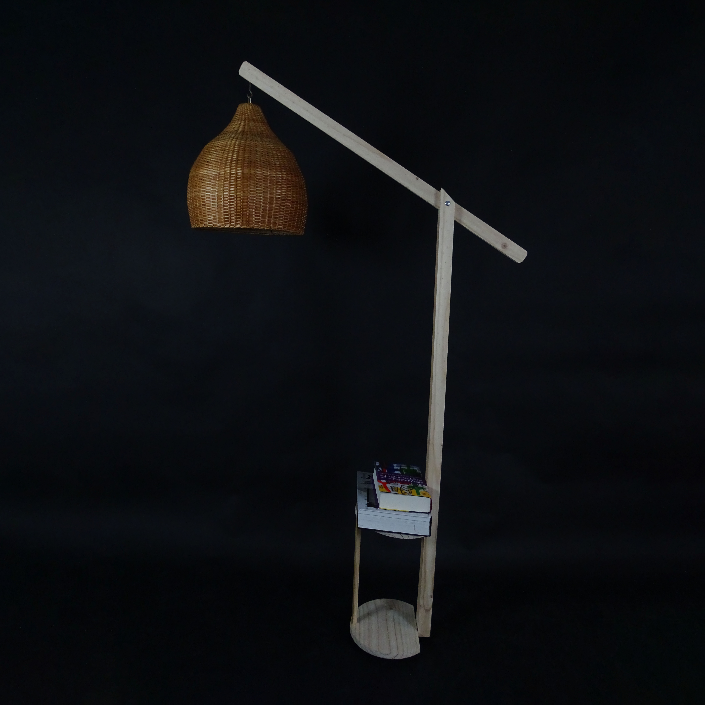

# examen grupo-03

## integrantes

* montecinos canales, valentina constanza
* sandoval labbé, sofía antonieta
* sepúlveda vera, janis valentina

## descripción

Nuestro objeto de resignificación es la lámpara, un elemento lumínico cotidiano que, a pesar de su necesidad diaria, a menudo pasa desapercibido. Extrae un mensaje del pasado para ofrecer compañía a través de una especie de cápsula del tiempo llena de recuerdos de la voz de tus seres queridos. Esta lámpara no solo ilumina, sino que también consuela y alegra, transmitiendo emociones de compañía, felicidad y ánimo.

## imágenes

## código