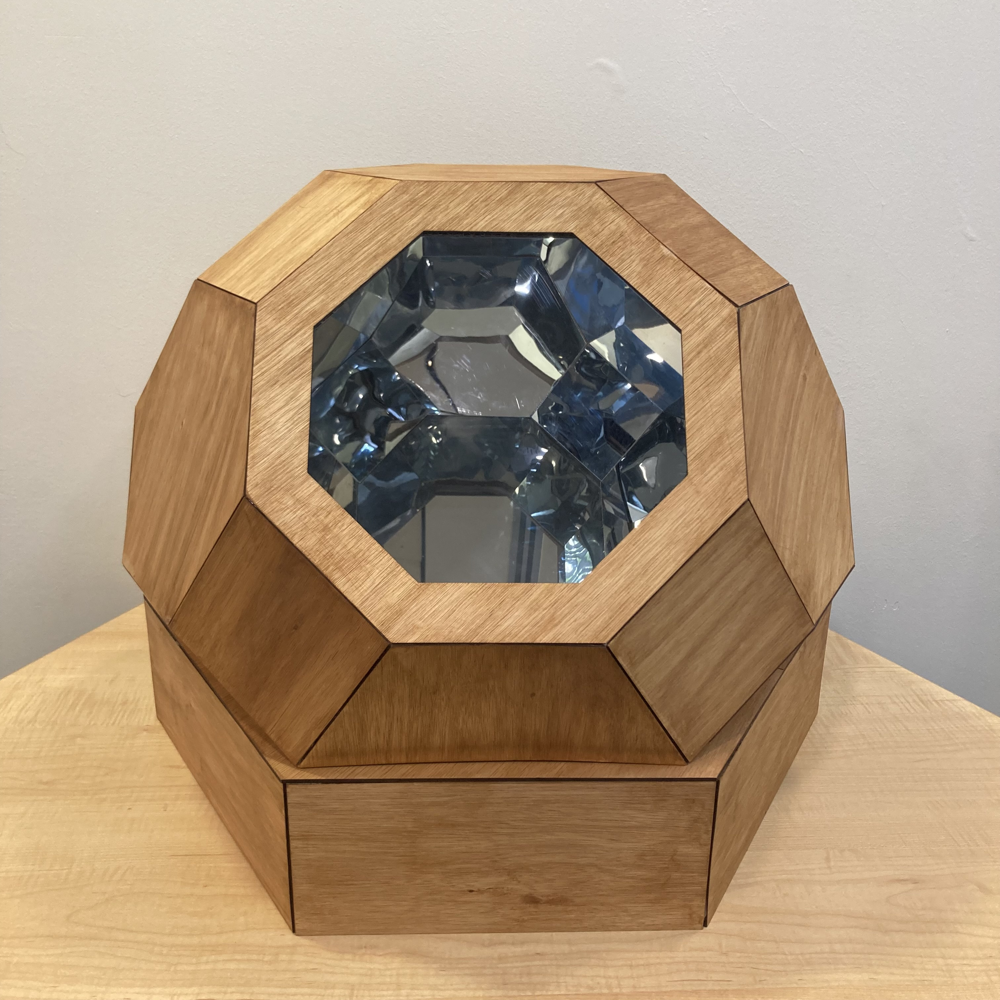
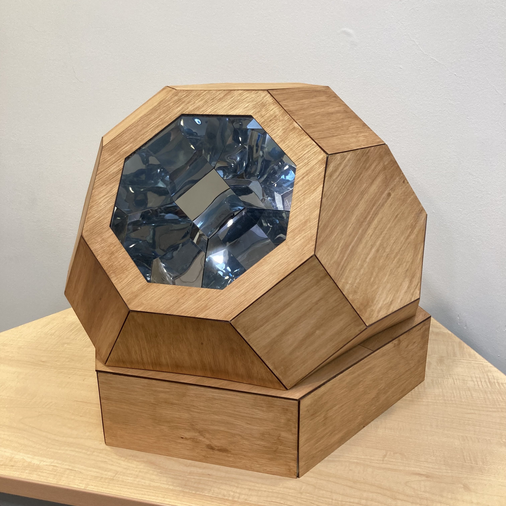
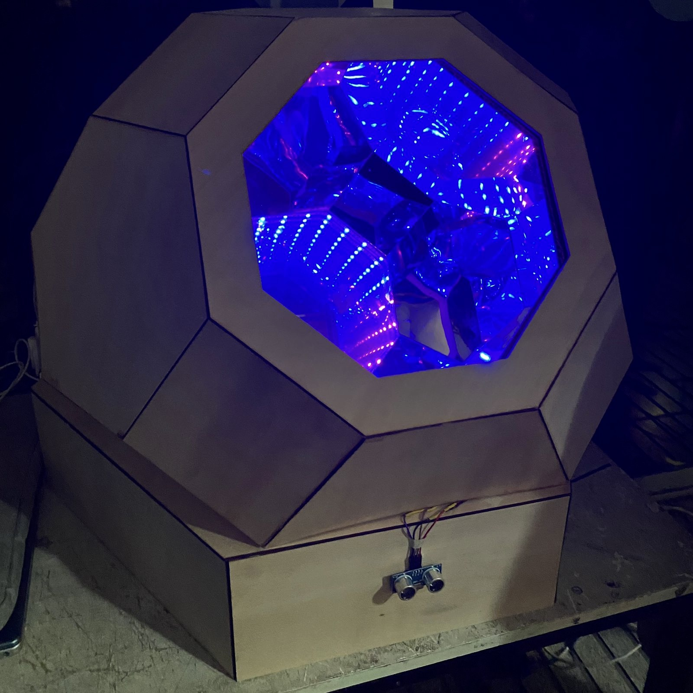
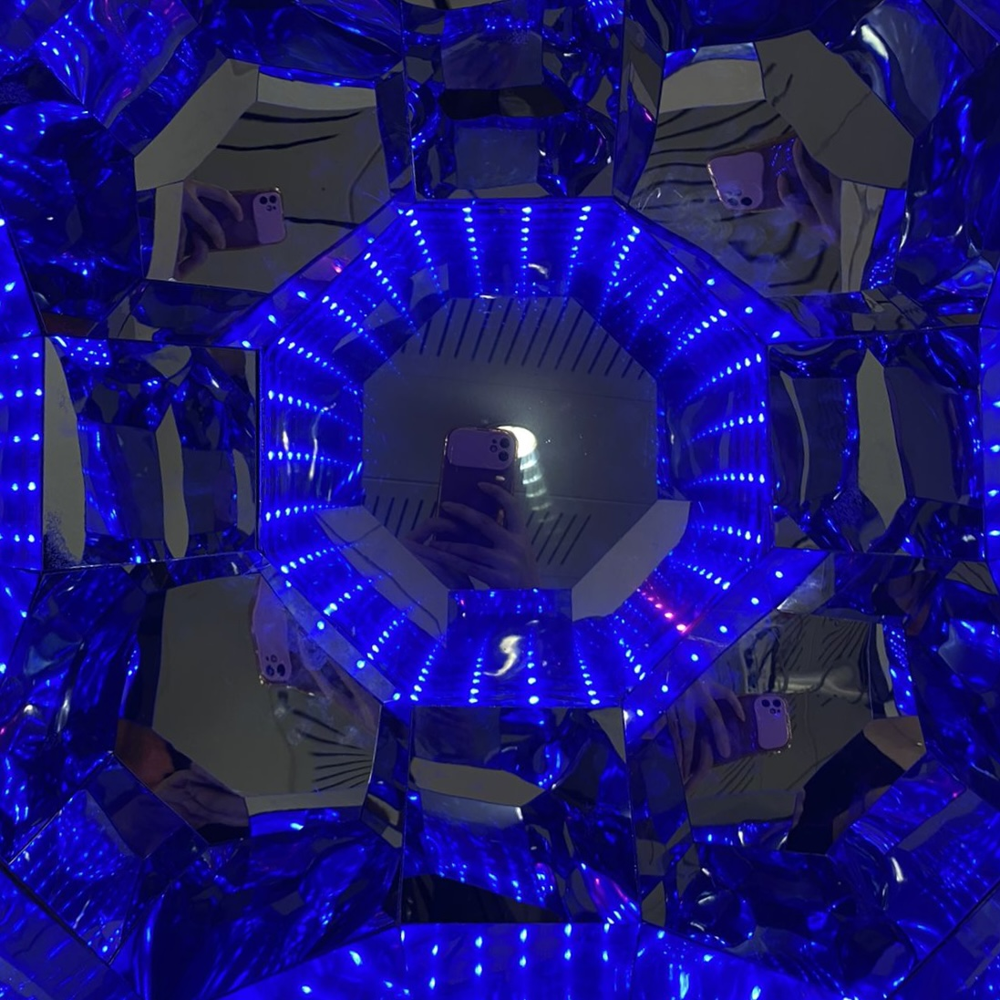

# examen grupo-04

## integrantes

* álvarez guzmán, catalina isabel
* astudillo soto, javiera paz
* bassaletti torres, aylen belén
* pimentel moraga, giuliana isidora

## descripción

ILLUME EGO redefine el espejo personal, centrando la experiencia en luces. Al acercarte, el sensor activa Leds rosados con mensajes positivos. Después, una luz verde te invita a dejar tu mensaje, seguido por una luz azul confirmando la grabación. Si te quedas, los Leds vuelven a rosa hasta tu partida. El nombre "ILLUME EGO" fusiona "iluminar" en latín con "ego", transmitiendo la idea de brillar por uno mismo. Un proyecto que potencia la autoafirmación en un breve y poderoso encuentro.

## imágenes










## código

### Processing

```java
import processing.serial.*;
import processing.sound.*;

Serial myPort;  // Create object from Serial class
int val;      // Data received from the serial port
SoundFile file;

String inString ="Primer inicio, sin data aun...";  // Input string from serial port
String[] audios={"audio01.wav", "audio02.wav", "audio03.wav", "audio04.wav", "audio05.wav"};


void setup()
{
  size(400, 200);
  // I know that the first port in the serial list on my mac
  // is always my  FTDI adaptor, so I open Serial.list()[0].
  // On Windows machines, this generally opens COM1.
  // Open whatever port is the one you're using.
  String portName = Serial.list()[0];
  printArray(Serial.list());
  myPort = new Serial(this, portName, 9600);
  fill(255);
  textSize(15);
}

void draw()
{
  background(0);
  if ( myPort.available() > 0) {  // If data is available,
    val = myPort.read();         // read it and store it in val
    println(val);
    

    if (val == 2) {
      int indice = int(random(5));
      inString =  str(val)  + " - Reproduciendo Audio0" + str(indice+1) + ".wav";
      print("audio0");
      println(indice);
      file = new SoundFile(this, audios[indice]);
      file.play();
    } else {
      inString = str(val)  + " -  esperando...";

    }
   
  }
   text("recibido: " + inString, 10, 50);
}
```

### Arduino

```cpp
#include "definicionesNeoPixel.h"
//""incluir archivos locales


const int trigger = 3;       // Pin digital 2 para el trigger del sensor
const int echo = 2;          // Pin digital 3 para el echo del sensor
const int numReadings = 10;  // Número de lecturas para el promedio móvil
int readings[numReadings];   // Arreglo para almacenar las lecturas
int indice = 0;               // indice actual en el arreglo
int total = 0;               // Suma de las lecturas


bool examen = true;

void setup() {
  Serial.begin(9600);  // Iniciamos la comunicación
  if (!examen) {
    Serial.println("configurarNeoPixel");
  }
  pixels.begin();  // INITIALIZE NeoPixel strip object (REQUIRED)
  apagarTodo();

  pinMode(trigger, OUTPUT);    // Pin como salida
  pinMode(echo, INPUT);        // Pin como entrada
  digitalWrite(trigger, LOW);  // Inicializamos el pin con 0
}

void loop() {

  if (sensor()) {
    animacion01();
    //animacion02();  // Si hay presencia, ejecuta la animación de neopíxeles
  }
  else {
     apagarTodo();
  }
  // Si no hay presencia, la animación se mantendrá apagada
}
```

```cpp
bool sensor() {

  bool presencia;
  long t;  // Tiempo que demora en llegar el eco
  long d;  // Distancia en centímetros

  digitalWrite(trigger, HIGH);
  delayMicroseconds(10);  // Enviamos un pulso de 10us
  digitalWrite(trigger, LOW);

  t = pulseIn(echo, HIGH);  // Obtenemos el ancho del pulso
  d = t / 59;               // Escalamos el tiempo a una distancia en cm

  // Agregar la nueva lectura y restar la lectura más antigua para el promedio móvil
  total = total - readings[indice];
  readings[indice] = d;
  total = total + readings[indice];
  indice = (indice + 1) % numReadings;


  // Calcular el promedio
  int averageDistance = total / numReadings;


  // Verificar si la distancia promedio es menor o igual a 30 cm y tomar una acción
  if (averageDistance <= 30) {
      presencia = true;
     if (!examen) {
    Serial.println("Presencia detectada");
     }
  } else {
   presencia = false;
       if (!examen) {
    Serial.println("No hay presencia");
       }
    
  }

  //delay(100);  // Hacemos una pausa de 100ms
  return presencia; 
}
```

```cpp
void animacion01() {
  byte cero = 0;
  Serial.write(cero);
  for (int i = 0; i < NUMPIXELS; i++) { // Para cada píxel...
    pixels.setPixelColor(i, pixels.Color(0, 0, 250)); // Color azul (puedes cambiarlo si lo deseas)
    pixels.show();   // Mostrar los cambios en los pixeles.
    delay(DELAYVAL);
  }

  delay(500); // Pausa antes de la próxima animación

  pixels.show();  // Mostrar los cambios 

  Serial.write(1);
  for (int i = 0; i < NUMPIXELS; i++) { // Para cada píxel...
    pixels.setPixelColor(i, pixels.Color(250, 250, 0)); // Color azul (puedes cambiarlo si lo deseas)
    pixels.show();   // Mostrar los cambios en los pixeles.
    delay(DELAYVAL);
  }

  delay(500); // Pausa antes de la próxima animación

  pixels.show();  // Mostrar los cambios (todos los pixeles apagados)
  
  
  Serial.write(2);
  delay(500);
  for (int i = 0; i < NUMPIXELS; i++) { // Para cada píxel...
    pixels.setPixelColor(i, pixels.Color(0 + (i * 5), 0, 60 - (i * 2))); // Color verde con variación
    pixels.show();   // Mostrar los cambios en los pixeles
    delay(DELAYVAL*2);
  }
  delay(4000); // Pausa antes de la próxima animación

  Serial.write(3);
  for (int i = 0; i < NUMPIXELS; i++) { // Para cada píxel...
    pixels.setPixelColor(i, pixels.Color(0, 170, 250)); // Color azul (puedes cambiarlo si lo deseas)
    pixels.show();   // Mostrar los cambios en los pixeles.
    delay(DELAYVAL/2);
  }

  delay(500); // Pausa antes de la próxima animación

  pixels.show();  // Mostrar los cambios 
  Serial.write(4);
  apagarTodo() ;
   delay(5000);
}
```

```cpp
void animacion02() {
  for (int i = 0; i < NUMPIXELS; i++) {  // For each pixel...
    pixels.setPixelColor(i, pixels.Color(0, 0, 250));
    pixels.show();  // Send the updated pixel colors to the hardware.
  }
    Serial.println("2");


  // The first NeoPixel in a strand is #0, second is 1, all the way up
  // to the count of pixels minus one.
  for (int i = 0; i < NUMPIXELS; i++) {  // For each pixel...

    // pixels.Color() takes RGB values, from 0,0,0 up to 255,255,255
    // Here we're using a moderately bright green color:
    pixels.setPixelColor(i, pixels.Color(195 + (i * 2), 0, 60 - (i * 2)));

    pixels.show();  // Send the updated pixel colors to the hardware.

    //delay(DELAYVAL / (i + 1));  // Pause before next pass through loop
    delay(DELAYVAL);  // Pause before next pass through loop

  }
  delay(5000);//delay de la anomacion final 
}
```

```cpp
void apagarTodo() {

  for (int i = 0; i < NUMPIXELS; i++) {              // For each pixel...
    pixels.setPixelColor(i, pixels.Color(0, 0, 0));  //arregalr color
    pixels.show();                                   // Send the updated pixel colors to the hardware.
  }
}
```

```cpp
#include <Adafruit_NeoPixel.h>

// el pin
#define PIN 6  // On Trinket or Gemma, suggest changing this to 1

// cuantos pixeles son
#define NUMPIXELS 30  // Popular NeoPixel ring size

#define DELAYVAL 50  // Time (in milliseconds) to pause between pixels

Adafruit_NeoPixel pixels(NUMPIXELS, PIN, NEO_GRB + NEO_KHZ800);
```

```cpp
//Conecta el cable de la tira de LEDs Neopixel al pin 6 de la placa Arduino.
//Asegúrate de alimentar la tira de LEDs.debe de haber un cable de alimentación y uno de tierra
//Conectar el Sensor Ultrasónico HC-SR04
//Conecta el cable VCC (alimentación) del sensor ultrasónico al pin 5V de la placa Arduino.
//Conecta el cable GND (tierra) del sensor ultrasónico al pin GND de la placa Arduino.
//Conecta el cable ECHO (eco) del sensor ultrasónico al pin 2 de la placa Arduino.
//Conecta el cable TRIG (disparo) del sensor ultrasónico al pin 3 de la placa Arduino.
```