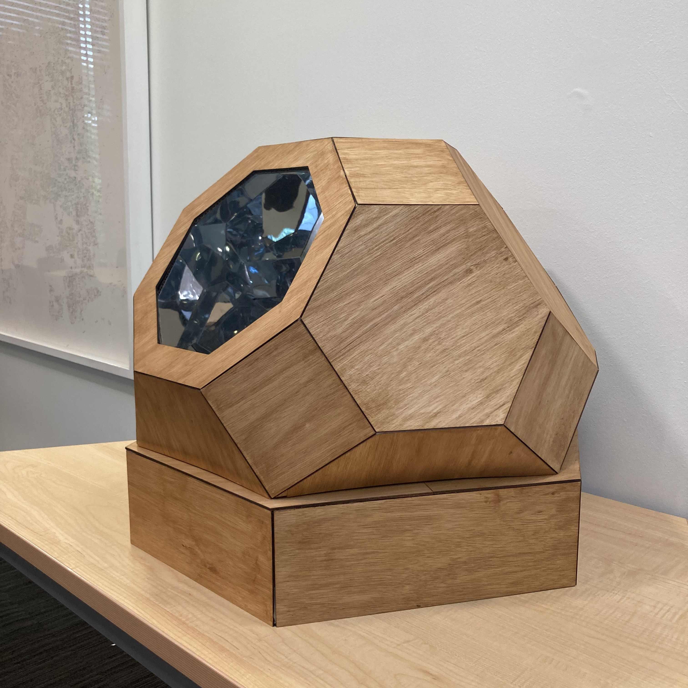

# examen grupo-04

## integrantes

* álvarez guzmán, catalina isabel
* astudillo soto, javiera paz
* bassaletti torres, aylen belén
* pimentel moraga, giuliana isidora

## descripción

ILLUME EGO redefine el espejo personal, centrando la experiencia en luces. Al acercarte, el sensor activa Leds rosados con mensajes positivos. Después, una luz verde te invita a dejar tu mensaje, seguido por una luz azul confirmando la grabación. Si te quedas, los Leds vuelven a rosa hasta tu partida. El nombre "ILLUME EGO" fusiona "iluminar" en latín con "ego", transmitiendo la idea de brillar por uno mismo. Un proyecto que potencia la autoafirmación en un breve y poderoso encuentro.

## imágenes

## código