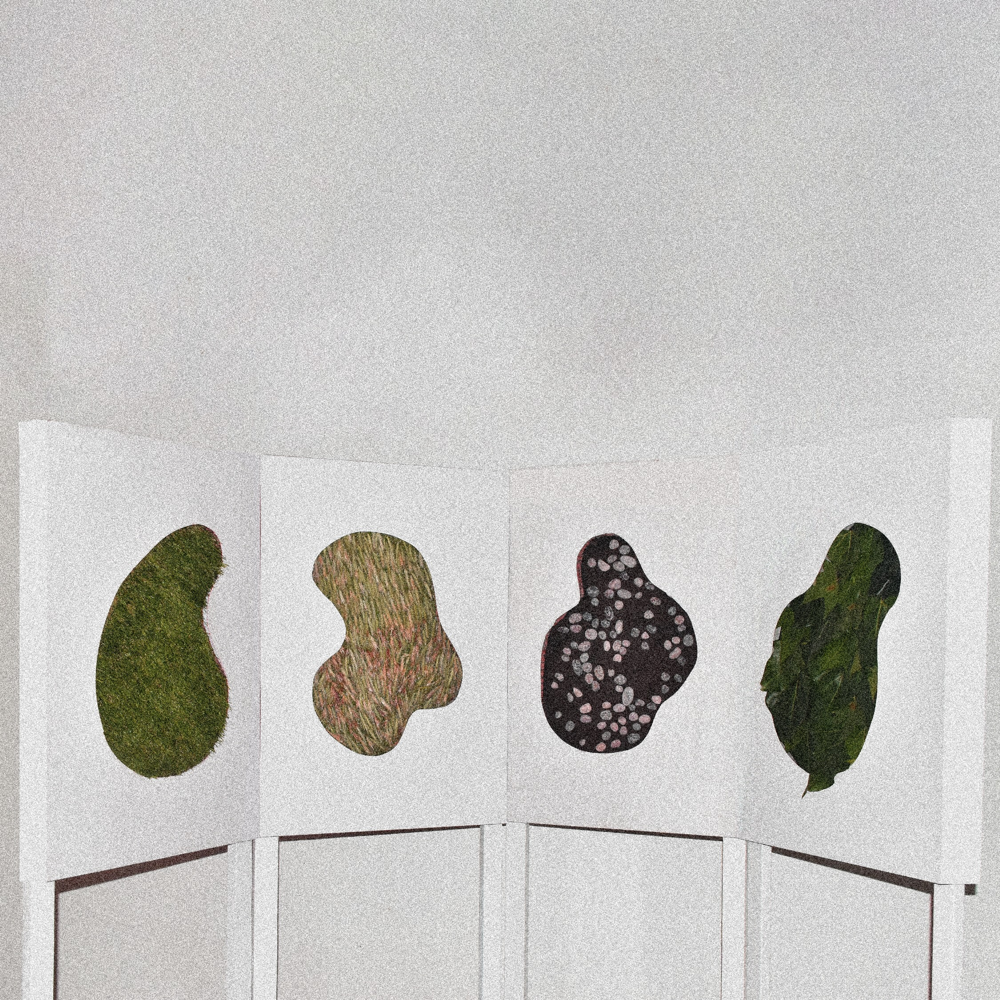

# examen grupo-05

## integrantes

* aspee jorquera, daniela estefanía
* astorga villar, bárbara alejandra
* zavala bunster, lucas benjamín

## descripción

Pensando en esta semana de Diseño Abierto y en las emociones negativas que esto provoca en los estudiantes, ya sea estrés, ansiedad, incertidumbre, enojo, nerviosismo, entre otras. Nos preguntamos, ¿De qué manera podríamos ayudar a calmar estas emociones, o bien, a distraerlos de ellas? Queremos algo que relaje a las personas de manera que las despierte por un momento de su angustia, que las haga conscientes de sí mismas y las traiga a un espacio libre e íntimo donde estén a solas consigo.

Es así que pensamos en estímulos que puedan impresionar y robar la atención, alejando pensamientos incómodos y de esta forma liberar momentáneamente el cuerpo de tensiones despertando la curiosidad y el asombro. Esto lo hicimos mediante estímulos sensoriales traídos de la naturaleza, en donde las personas podrán estar en contacto con distintos elementos de ella. Además, queremos ahuyentar el ruido de los exámenes con audífonos en donde las personas oirán sonidos de aves, ríos, viento y hojas, creando una experiencia inmersiva en donde los estudiantes se transporten a un bosque, a un río, a una pradera o lo que su imaginación sugiera.

## imágenes




## código

```java
// importar biblioteca Processing Sound
import processing.sound.*;

// crear lista para los nombres de los archivos
StringList nombresArchivos = new StringList();

// crear String para la extension usada
String extension = ".mp3";

// crear lista para los sonidos
ArrayList<SoundFile> sonidos = new ArrayList<SoundFile>();

int sonidoActual = 0;
float[] volumenActual = {1,1,1,1};


// arreglos con variables para cada sonido
boolean[] presionando = {false, false, false, false};
//long[] tiemposoltadoTecla = {-1, -1, -1, -1};


void setup() {

  // configurar lienzo
  size(640, 360);

  // fondo blanco del lienzo
  background(255);

  // agregar nombres de archivos
  nombresArchivos.append("pastizal");
  nombresArchivos.append("hoja");
  nombresArchivos.append("pastos");
  nombresArchivos.append("piedra");


  // recorrer los nombres de los archivos

  for (int i = 0; i < nombresArchivos.size(); i++) {
    // cargar los sonidos
    sonidos.add(new SoundFile(this, nombresArchivos.get(i) + extension));
  }
}

void draw() {
  // Ajustar el volumen según la cantidad de teclas presionadas
  //float volumenActual = (audioActual != 0) ? 0.5 : 1.0;

  // establecer el voumen de todos los sonidos
  for (int i = 0; i < sonidos.size(); i++) {
    // cargar los sonidos
    sonidos.get(i).amp(volumenActual[i]);
  }

  // tocar segun la superficie
  for (int i = 0; i < sonidos.size(); i++) {
    if (i == sonidoActual && !sonidos.get(i).isPlaying()) {
      sonidos.get(i).play();
    }
  }
  // para apagar los sonidos
  for (int i = 0; i < sonidos.size(); i++) {
    // si han pasado 5 segundos desde que solte la tecla y no la he vuelto a tocar
    if (!presionando[i] && volumenActual[i]>0) {
      // aca ponemos el numero para bajar el volumen
      volumenActual[i] -= 0.008;
    }
  }
}

// funcion llamada cuando se presiona una tecla
void keyPressed() {
  if (key == CODED) {
    if (keyCode == UP) {
      volumenActual[0] = 1;
      presionando[0] = true;
      sonidoActual = 0;
    } else if (keyCode == DOWN) {
      volumenActual[1] = 1;
      presionando[1] = true;
      sonidoActual = 1;
    } else if (keyCode == RIGHT) {
      volumenActual[2] = 1;
      presionando[2] = true;
      sonidoActual = 2;
    } else if (keyCode == LEFT) {
      volumenActual[3] = 1;
      presionando[3] = true;
      sonidoActual = 3;
    } else {
      sonidoActual = -1;
    }
  }
}

// apaga el sonido que le digamos
void apagarSonido(int n) {
  sonidos.get(n).stop();
}

// funcion llamada cuando se suelta una tecla
void keyReleased() {
  if (key == CODED) {
    if (keyCode == UP) {
      presionando[0] = false;
      //tiemposoltadoTecla[0] = millis();
    } else if (keyCode == DOWN) {
      presionando[1] = false;
      //tiemposoltadoTecla[1] = millis();
    } else if (keyCode == RIGHT) {
      presionando[2] = false;
      //tiemposoltadoTecla[2] = millis();
    } else if (keyCode == LEFT) {
      presionando[3] = false;
      //tiemposoltadoTecla[3] = millis();
    }
  }
}
```