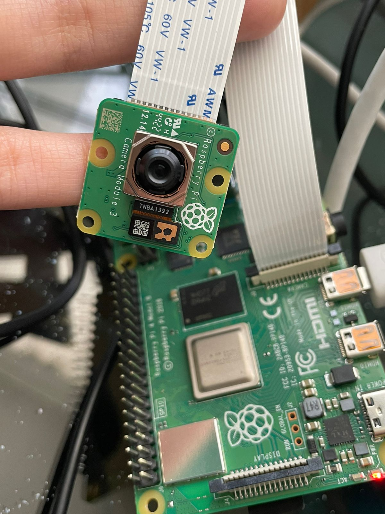
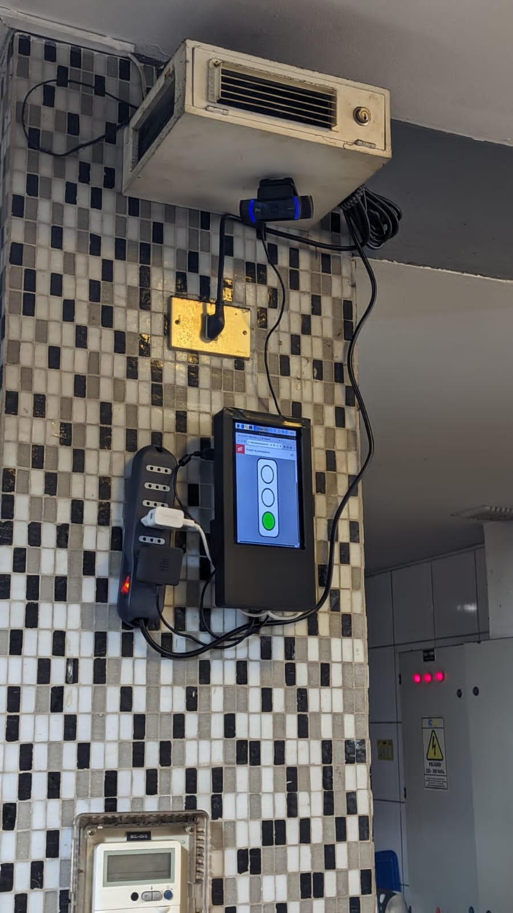
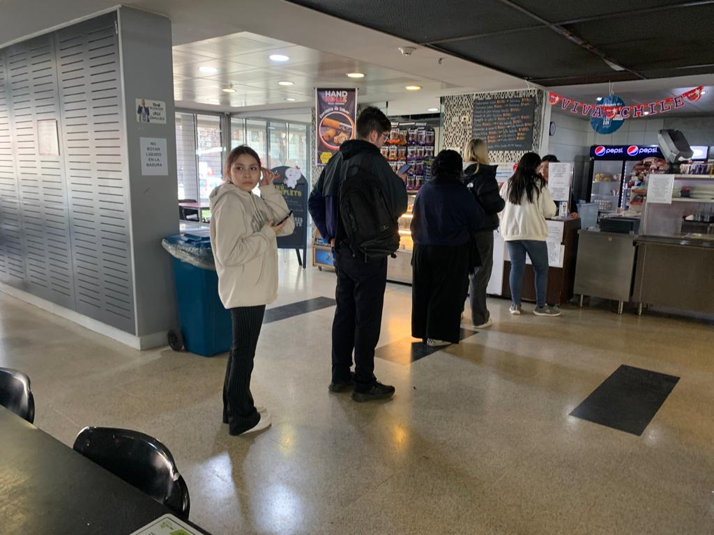

# solemne-02 grupo-01

## integrantes

* montecinos canales, valentina constanza
* sepúlveda vera, janis valentina

## descripción

Nuestro semáforo de llenitud tiene como propósito mostrar a los estudiantes que van al comedor de la FAAD la cantidad de personas en la fila. Esto les ayuda a decidir si comprar dentro o fuera de la universidad. Cuando hay de 0 a 5 personas, la luz verde se mantiene encendida; de 6 a 10, la luz amarilla se enciende; y de 11 a 20, la luz roja se activa. Utilizamos una Raspberry Pi como cerebro digital, aprovechando su capacidad de procesamiento. La webcam, junto con PoseNet, estima los puntos clave del cuerpo humano mediante machine learning. Para la visualización, empleamos p5.js, una biblioteca web de JavaScript. Finalmente, coordinamos todo el proyecto localmente mediante Python, conectando la entrada de la cámara y comunicándonos con la Raspberry Pi sin necesidad de conexión a internet.

## imágenes

