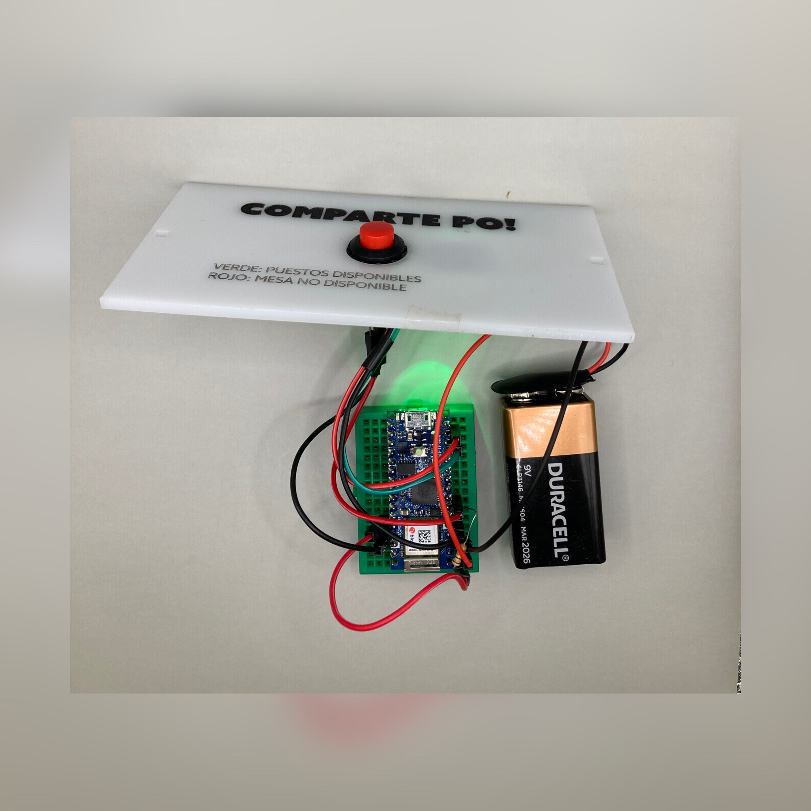
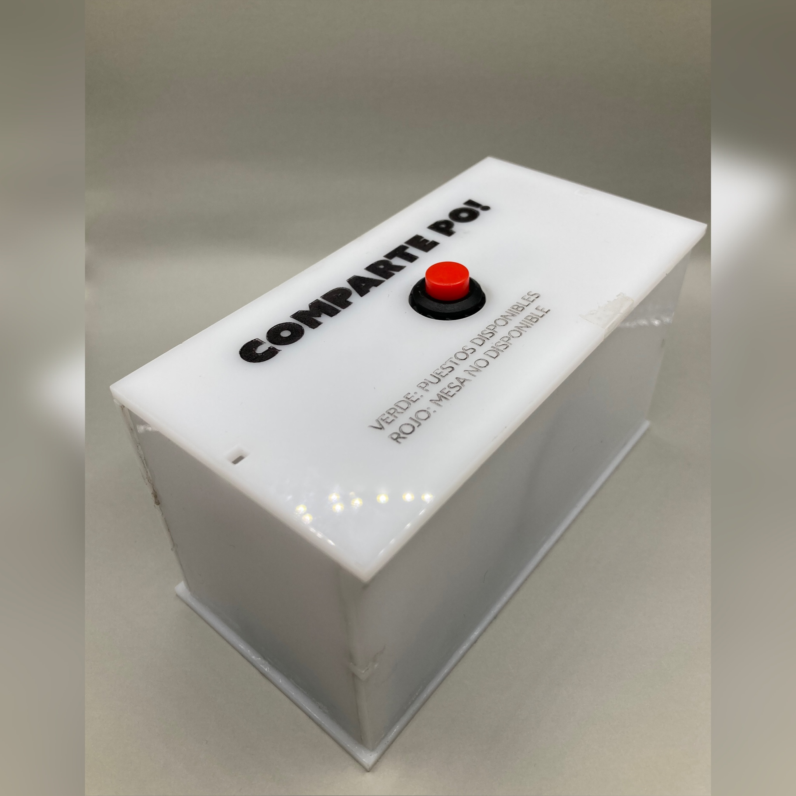
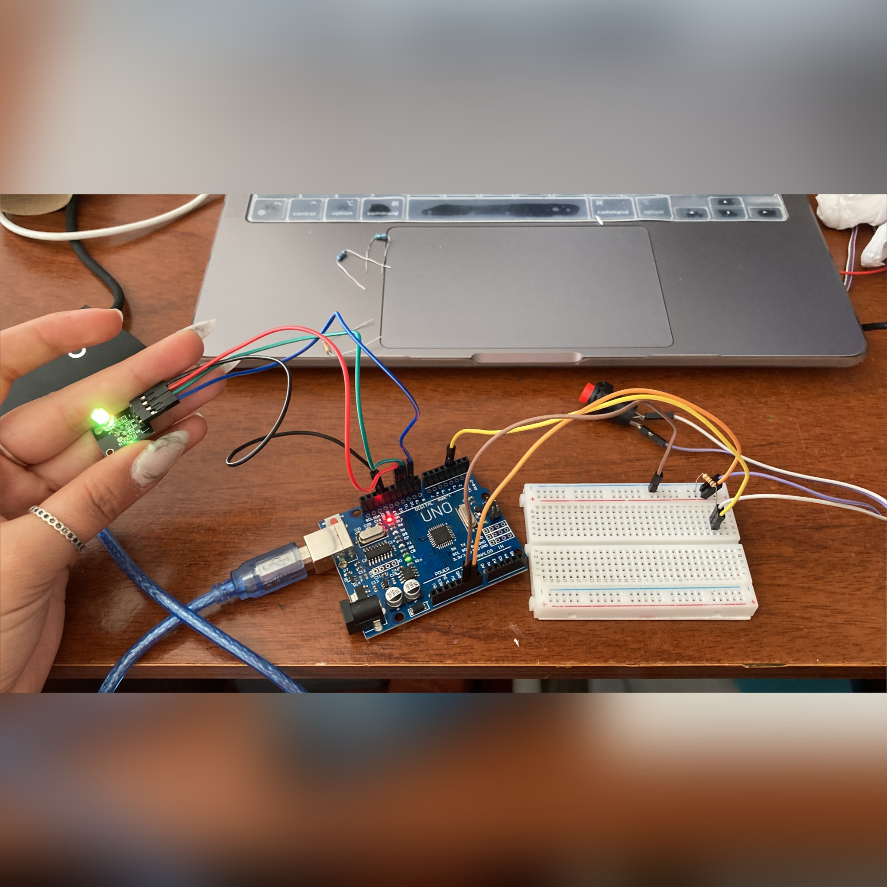

# solemne-02 grupo-02

## integrantes

* astudillo soto, javiera paz
* pimentel moraga, giuliana isidora
* sandoval labbé, sofía antonieta

## descripción

"Comparte po" es un dispositivo diseñado con el propósito de fomentar la interacción social y facilitar el uso compartido de mesas en el casino de la FAAD. Este dispositivo presenta dos estados distintos: el primero se representa mediante un color verde, indicando que el puesto está disponible para compartir la mesa, mientras que el segundo estado se muestra en color rojo, señalando que la mesa no está disponible para compartir.

El "Comparte po" está diseñado para colocarse sobre las mesas del casino y es altamente portable, lo que significa que se puede mover y ubicar según la conveniencia del usuario. Esta movilidad es especialmente útil, ya que, en muchas ocasiones, los estudiantes necesitan realizar tareas adicionales mientras comen, como entregar proyectos, tomar apuntes, ver videos o incluso disfrutar de una partida de cartas. Por lo tanto, la portabilidad del dispositivo contribuye significativamente a la comodidad de los estudiantes.

## imágenes







## código

```cpp
//comparte po
// objeto disenado para conpartir mesa en el casino udp, mediante un dispositivo
//intuitivo de usar.
// el dispositivo estara con luz verde al momento que llegues a sentarte, y si quieres compartir puedes dejarlo asi
// de lo contrario estara un boton que puede cambiar el estado a no disponible con el color rojo

//referencia https://arduino-spain.site/led-rgb/

// Definimos constante,ubicacion pin 
const int botonPin = 3;
#define RED 11
#define GRN 10

// Variable tiempo inicial
unsigned long tiempoInicio = 0;
// Indicador de inicio
bool empezar = false;

bool probando = true;

long tiempoBoton = -1;

int tiempoDebounce = 500;

void setup() {
  // Configuramos el botón como entrada con resistencia pull-up
  pinMode(botonPin, INPUT_PULLUP);
  // Configuramos las luces ROJA y VERDE como salidas
  pinMode(RED, OUTPUT);
  pinMode(GRN, OUTPUT);

  prenderLuzVerde();

  if (probando) {
    Serial.begin(9600);
  }
}

void loop() {
  if (digitalRead(botonPin) == LOW) {
    if (!empezar) {
      empezar = true;
      prenderLuzRoja();
      tiempoInicio = millis();
    } else {
      empezar = false;
      prenderLuzVerde();
    }
  }

  if (empezar) {
    unsigned long tiempoTranscurrido = millis() - tiempoInicio;

    if (tiempoTranscurrido >= 1800000) {  // 30 minutos en milisegundos // 120000 probar 2 min clase
      empezar = false;
      prenderLuzVerde();
    }
  }
}
//se realizo esto, apagar luz para despues prender las sin interferencias(luz amarilla entre lapso de cambio)
void apagarLuces() {
  digitalWrite(RED, LOW);
  digitalWrite(GRN, LOW);
//se anadio aca serial.println para ver en el monitor si funciona el cambio de luz con el boton
  if (probando) {
    Serial.println("apagar");
  }
}
//prender luz roja 
void prenderLuzRoja() {
  apagarLuces();
  digitalWrite(RED, HIGH);
  if (probando) {
    Serial.println("roja");
  }
}
//prender luz verde 
void prenderLuzVerde() {
  apagarLuces();
  digitalWrite(GRN, HIGH);
  if (probando) {
    Serial.println("verde");
  }
}
```