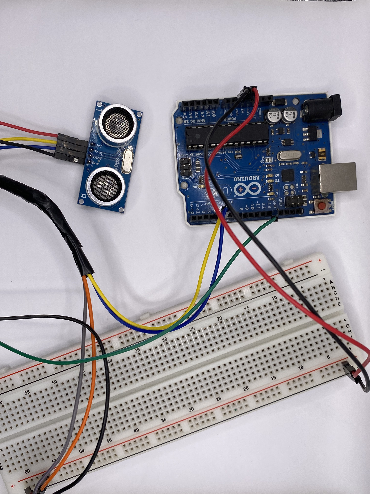
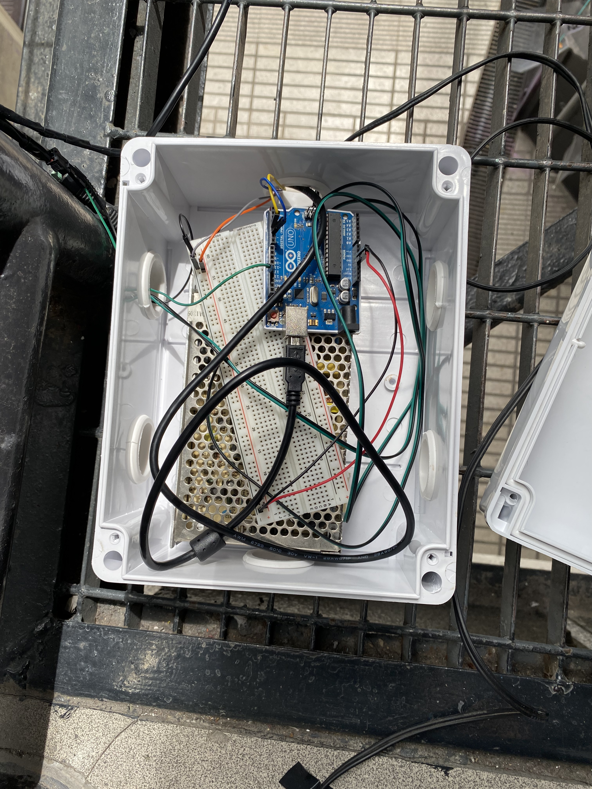
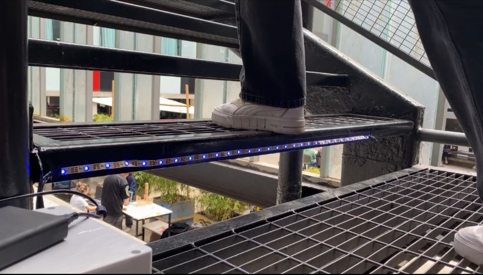

# solemne-02 grupo-03

## integrantes

* arellano palomino, camila ignacia
* aspee jorquera, daniela estefanía
* astorga villar, bárbara alejandra
* zavala bunster, lucas benjamín

## descripción

### PROYECTO

“Escalera interactiva” es un proyecto que busca incentivar el uso de esta escalera, ya que luego de observar y comparar los distintos caminos que la gente utiliza para moverse dentro de la universidad, se llega a la conclusión de que estas escaleras metálicas son notoriamente menos recurrentes que el ascensor y las otras escaleras de la facultad. Lo que provoca que en estas últimas se genere mucho tráfico, sobre todo a la hora de almuerzo. Los motivos por el poco uso de esta escalera en particular, se deben a que resulta incómoda para los estudiantes y porque no se conecta con el primer piso. 
Es por esto que se crea el proyecto “Escalera interactiva", el cual tiene el propósito de incentivar su uso por medio de la instalación de luces generando un espacio más atractivo, y así también, diversificar el tráfico entre las distintas vías entre pisos.

Este proyecto se crea mediante el uso de luces led instaladas en cada uno de los peldaños de la escalera, las cuales responden a sensores ultrasónicos dispuestos sobre cada escalón que cuando detectan movimiento envían la señal a estas para que se enciendan. Es así que al momento de apoyar el pie en un escalón este se enciende, generando una interacción entre el usuario y la escalera, y creando un trayecto más divertido.

### PROCESO

Se programó previamente mediante códigos toda la interacción: cuando el sensor detecte presencia en un rango de distancia de 4 cm a 130 cm, los neopixeles que correspondan al peldaño detectado, se prenderán; y se apagan cuando ya no se detecte movimiento. 

### MATERIALES

Para la creación del proyecto se utilizaron los siguientes materiales: arduino uno, sensor ultrasónico, protoboard, tiras de neopixel y el uso de software como Tinkercad, Wokwi y Arduino IDE. Y en cuanto a su instalación se necesitó una caja estanca con conos donde se guardó todo el sistema de circuito, y cinta aisladora ya que al trabajar sobre una escalera de metal podían haber interferencias en el código.

## imágenes







## código

```cpp
#include <Adafruit_NeoPixel.h>

#define TRIG 4
#define ECHO 5
#define NUM_PIXELS 30

Adafruit_NeoPixel tira = Adafruit_NeoPixel(NUM_PIXELS, 13, NEO_GRB + NEO_KHZ800);
long duracion, distancia;

void setup() {
  tira.begin();
  tira.show();
  pinMode(TRIG, OUTPUT);
  pinMode(ECHO, INPUT);
  Serial.begin(9600);
}

void loop() {
  digitalWrite(TRIG, LOW);
  delayMicroseconds(2);
  digitalWrite(TRIG, HIGH);
  delayMicroseconds(10);
  digitalWrite(TRIG, LOW);
  duracion = pulseIn(ECHO, HIGH);
  distancia = (duracion / 2) / 29.1; // Calcula la distancia en centímetros

  Serial.println(distancia);

  if (distancia > 4 && distancia <= 130) {
    // Detección de presencia: Encender los LEDs
    for (int i = 0; i < NUM_PIXELS; i++) {
      tira.setPixelColor(i, 0, 0, 255);
    }
    tira.setBrightness(100);
    tira.show();
  } else {
    // No se detecta presencia: Apagar los LEDs
    for (int i = 0; i < NUM_PIXELS; i++) {
      tira.setPixelColor(i, 0, 0, 0);
    }
    tira.setBrightness(0); // Ajusta el brillo a 0 para apagar los LEDs
    tira.show();
  }
}
```