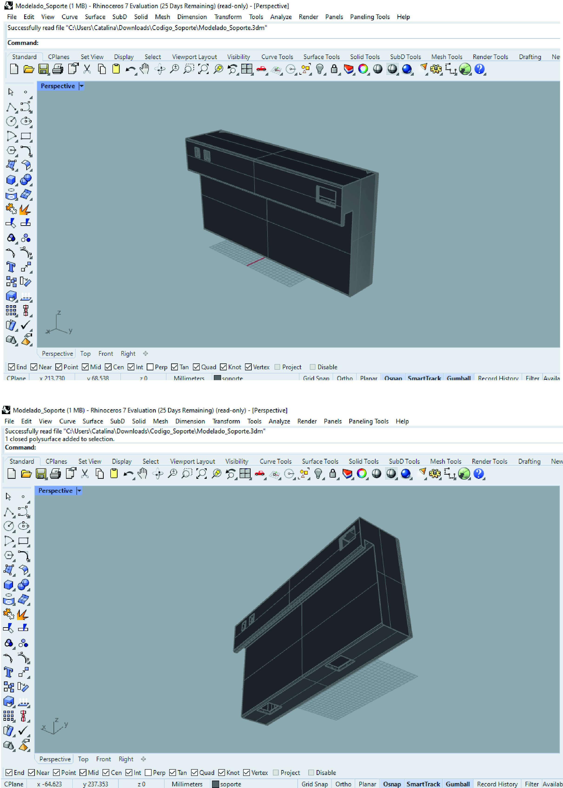
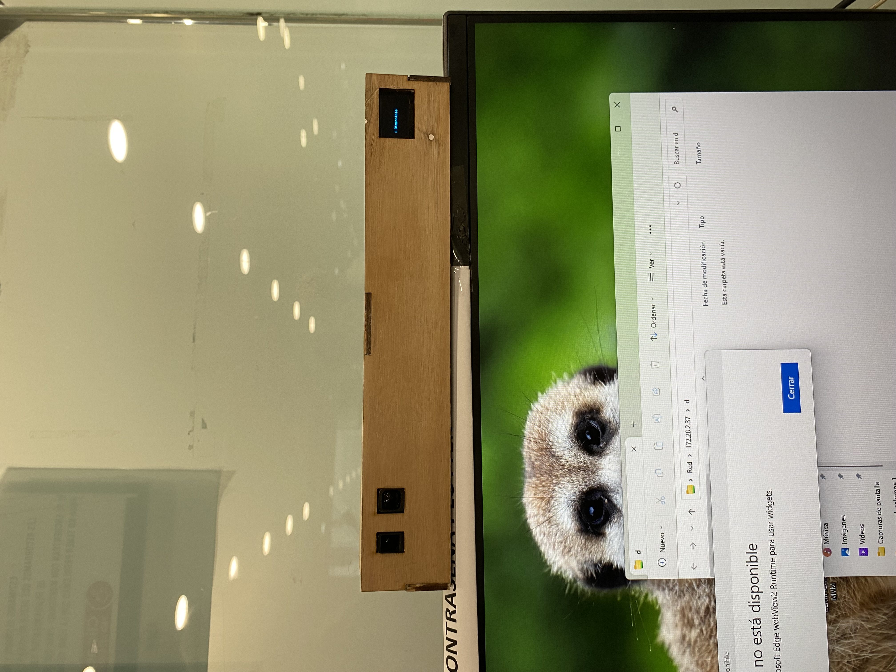
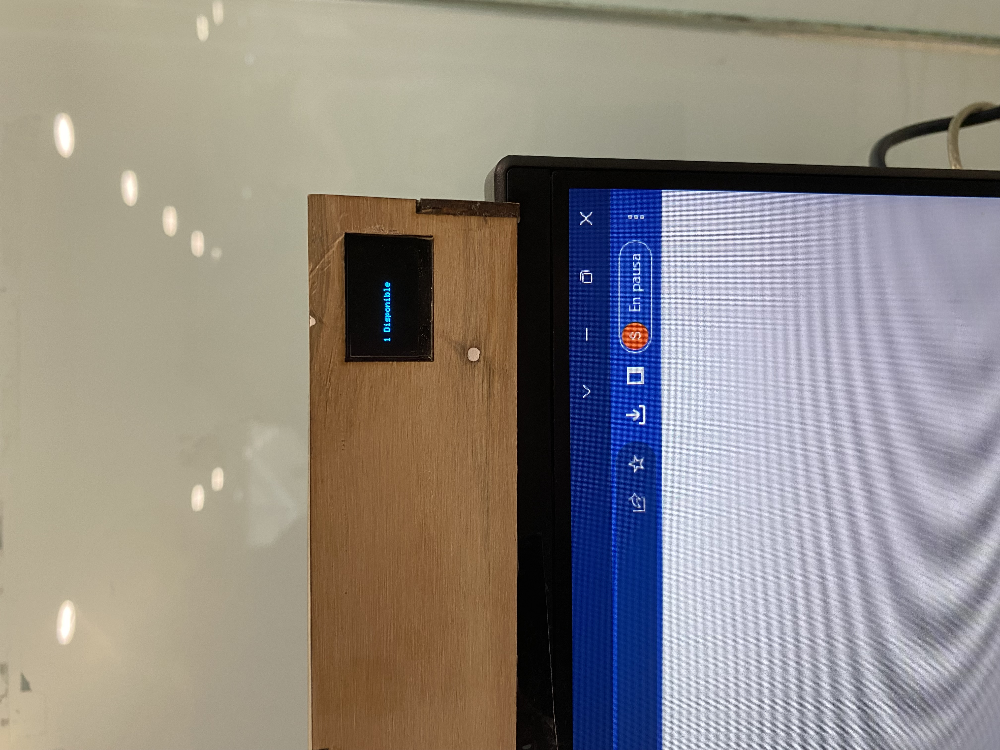

# solemne-02 grupo-04

## integrantes

* álvarez guzmán, catalina isabel
* bassaletti torres, aylen belén

## descripción

### Proyecto

El proyecto "DeskMon" está diseñado para optimizar la experiencia de los usuarios en la sala Alpha. Su objetivo principal es garantizar que los usuarios encuentren rápidamente una estación de trabajo disponible, reduciendo la incertidumbre y la molestia asociada con la búsqueda de un lugar para trabajar.

### Características

Monitoreo en Tiempo Real: "DeskMon" supervisa constantemente la disponibilidad de las estaciones de trabajo en la sala de computadoras. Utilizando sensores Sharp detecta la presencia de usuarios en cada estación.

Visualización en Pantalla OLED: Los resultados del monitoreo se muestran en tiempo real en una pantalla OLED. Los usuarios pueden ver de un vistazo cuántas estaciones de trabajo están disponibles.

Mejora de la Eficiencia: La eficiencia de la sala de computadoras se optimiza, ya que los usuarios pueden ingresar y comenzar a trabajar de manera más rápida y efectiva.

### Beneficios para los Usuarios

* Mayor comodidad.
* Mayor eficiencia y productividad.
* Reducción de estrés y molestias.
* Confianza en la tecnología y la sala de computadoras.

### Conclusión

"DeskMon" es una solución que pone en primer plano la experiencia del usuario en una sala de computadoras. Al proporcionar información en tiempo real sobre la disponibilidad de estaciones de trabajo, mejora la comodidad y eficiencia de los usuarios, generando una experiencia más positiva en un entorno de trabajo compartido.

## imágenes







## código

```cpp
#include <Wire.h>
#include <Adafruit_GFX.h>
#include <Adafruit_SSD1306.h>
#include <Adafruit_Sensor.h>

// Definir constantes
#define ANCHO_PANTALLA 128 // ancho pantalla OLED
#define ALTO_PANTALLA 64    // alto pantalla OLED

// Objeto de la clase Adafruit_SSD1306
Adafruit_SSD1306 display(ANCHO_PANTALLA, ALTO_PANTALLA, &Wire, -1);

// Sensores Sharp #1 y #2
const int sensorPin1 = A0; // Pin analógico para Sharp #1
const int sensorPin2 = A1; // Pin analógico para Sharp #2

// Variables para los valores actuales de los sensores
int sensorValor1 = -1;
int sensorValor2 = -1;

// Valores umbrales para "presencia" y "no presencia"
int umbralPresencia = 20; // Cambiar según el rango deseado
int umbralNoPresencia = 70; // Cambiar según el rango deseado

// Variable para la disponibilidad
int disponibilidad = -1;

void setup() {
  // Iniciamos la comunicación serial
  Serial.begin(9600);
  
  // Iniciar pantalla OLED en la dirección 0x3C
  if (!display.begin(SSD1306_SWITCHCAPVCC, 0x3C)) {
    Serial.println("No se encuentra la pantalla OLED");
    while (true);
  }

  // Limpiar buffer
  display.clearDisplay();

  // Tamaño del texto
  display.setTextSize(1);
  // Color del texto
  display.setTextColor(SSD1306_WHITE);
  // Posición del texto
  display.setCursor(10, 32);
  // Activar página de código 437
  display.cp437(true);

  // Inicializar la disponibilidad como "Desconocida"
  disponibilidad = -1;
}

void loop() {
  // Actualizar lecturas de los sensores
  sensorValor1 = analogRead(sensorPin1);
  sensorValor2 = analogRead(sensorPin2);

  // Determinar la disponibilidad en función de los umbrales de presencia y no presencia
  if (sensorValor1 >= umbralPresencia && sensorValor2 >= umbralPresencia) {
    disponibilidad = 0; // Ambos sensores detectan presencia
  } else if (sensorValor1 >= umbralPresencia || sensorValor2 >= umbralPresencia) {
    disponibilidad = 1; // Al menos un sensor detecta presencia
  } else {
    disponibilidad = 2; // Ambos sensores detectan no presencia
  }

  // Mostrar la disponibilidad en la pantalla OLED
  display.clearDisplay();
  display.setTextSize(1);
  display.setCursor(10, 32);

  switch (disponibilidad) {
    case 0:
      display.println("0 Disponible");
      break;
    case 1:
      display.println("1 Disponible");
      break;
    case 2:
      display.println("2 Disponibles");
      break;
    default:
      display.println("Desconocido");
      break;
  }

  // Enviar a pantalla
  display.display();
  
  // Retraso de 1 segundo (1000 milisegundos)
  delay(1000);
}
```