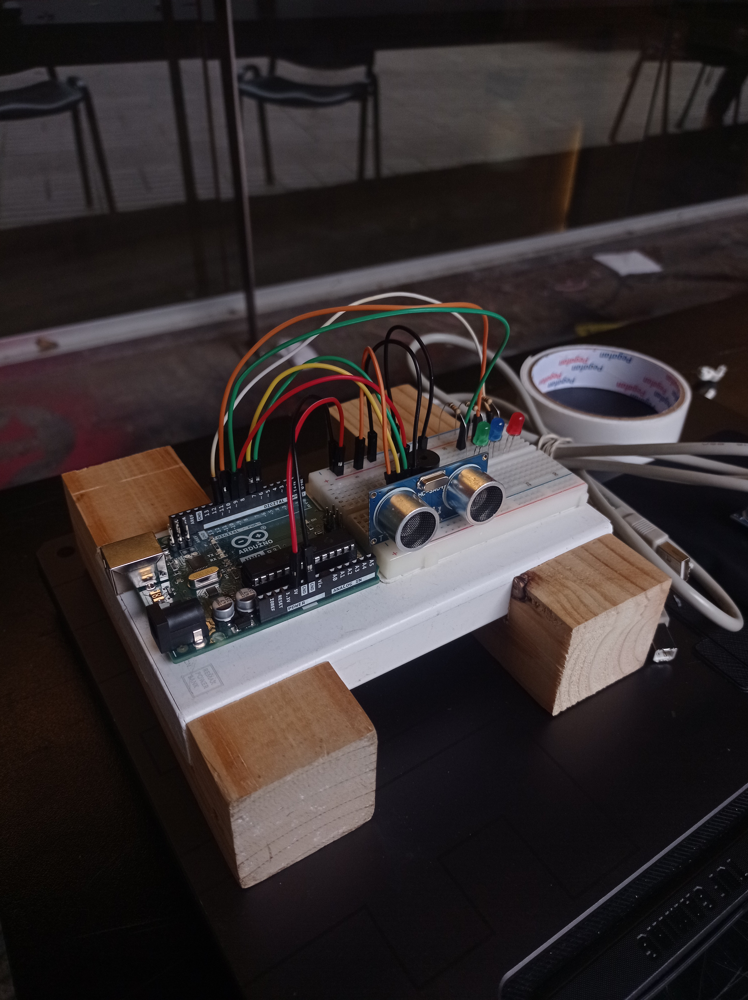

# solemne-02 grupo-06

## integrantes

* núñez riquelme, martín ignacio
* villar poblete, manuel josé

## descripción

### Proyecto

“Acusete”, es un proyecto que busca mantener a los estudiantes al tanto del tiempo real que pasan sentados en los mesones, mejorando así la noción del tiempo y la efectividad de los tiempos de trabajo y así ayudar con el problema de la falta de espacios en los mesones del patio central de la FAAD. 

Según nuestra encuesta, se le asigna gran parte de la problemática a las personas que pasan demasiado tiempo sentados en el lugar y de cierta forma terminan “acaparando los puestos”

### Planteamiento del sistema a desarrollar

Crear un sistema con un sensor que detecte presencia humana y que indique a través de luces led el tiempo que ha transcurrido desde que una persona se sentó en un mesón, para posteriormente activar una alarma (buzzer) si la persona no se va del lugar.

### Pasos del sistema

1- El sensor ultrasónico hace una calibración de 10 segundos para pasado estos segundos empezar con la detección.

2- El sensor manda señal para activar los leds. El primer led se enciende tras pasar los 5 segundos de detección, el segundo a los 10 segundos y el tercero a los 15 segundos.

3- Tras pasar los 15 segundos y prenderse el tercer led, los tres leds se apagan.

4- Luego de que los leds se apagan, pasan 2 segundos y los 3 leds empiezan a parpadear de forma arrítmica durante 10 segundos. 

5- Pasados estos 10 segundos se activa un buzzer que sonara como una alarma.

### Notas adicionales

1- El sensor mide hasta una distancia de 1,20 metros.

2- El sistema solo funciona si el sensor está detectando presencia. En caso de dejar de recibir señal todo el sistema se reinicia.

## imágenes




## código

```cpp
const int trigPin = 7;      // Pin del emisor de pulso o señal
const int echoPin = 6;      // Pin del receptor "del eco" del pulso o señal
const int buzzerPin = 8;    // Pin del zumbador
const int led1Pin = 9;      // Pin del primer LED
const int led2Pin = 10;     // Pin del segundo LED
const int led3Pin = 11;     // Pin del tercer LED

const unsigned long calibracionDuracion = 10000;  // Duración de la calibración en milisegundos (10 segundos)
const unsigned long led1Delay = 5000;            // Retraso para encender el primer LED después de la detección (5 segundos)
const unsigned long led2Delay = 10000;           // Retraso para encender el segundo LED después de la detección (10 segundos)
const unsigned long led3Delay = 15000;           // Retraso para encender el tercer LED después de la detección (15 segundos)
const unsigned long apagarLedsDelay = 17000;     // Retraso para apagar todos los LEDs (17 segundos)
const unsigned long parpadeoDuracion = 10000;    // Duración del parpadeo de LEDs (10 segundos)

unsigned long tiempoInicio = 0;                 // Almacena el tiempo en milisegundos en que se detectó movimiento
boolean sensorActivo = false;                   // Indica si el sensor ultrasónico está actualmente activo

void setup() {
  pinMode(trigPin, OUTPUT);     // Configura el pin del emisor como salida
  pinMode(echoPin, INPUT);      // Configura el pin del receptor como entrada
  pinMode(buzzerPin, OUTPUT);   // Configura el pin del zumbador como salida
  pinMode(led1Pin, OUTPUT);     // Configura el pin del primer LED como salida
  pinMode(led2Pin, OUTPUT);     // Configura el pin del segundo LED como salida
  pinMode(led3Pin, OUTPUT);     // Configura el pin del tercer LED como salida

  Serial.begin(9600);           // Inicializa la comunicación serial
}

void loop() {
  long duration, distance;       // Variables para medir la duración y distancia

  if (!sensorActivo) {
    calibrarSensor();           // Realiza la calibración inicial
  }

  duration = medirDistancia();   // Mide la distancia con el sensor ultrasónico
  distance = duration * 0.034 / 2; // Calcula la distancia en centímetros

  Serial.print("Distancia: ");
  Serial.print(distance);
  Serial.println(" cm");

  if (distance < 120) {         // Si la distancia es menor de 120 cm (1 metro y 20 centímetros)
    activarLeds();               // Activa los LEDs según el paso del proceso
  } else {
    reiniciarSistema();          // Si no se detecta presencia, reinicia el sistema
  }
}

void calibrarSensor() {
  digitalWrite(trigPin, LOW);    // Asegura que el pin de emisor esté bajo
  delay(1000);                    // Espera un segundo
  Serial.println("Calibración en curso...");
  digitalWrite(trigPin, HIGH);   // Envía un pulso de 10 microsegundos
  delayMicroseconds(10);
  digitalWrite(trigPin, LOW);
  delay(calibracionDuracion);     // Espera durante la calibración
  Serial.println("Calibración completada. Sistema activo.");
  sensorActivo = true;            // Marca el sensor como activo
}

long medirDistancia() {
  digitalWrite(trigPin, LOW);     // Envía un pulso limpio: baja el pin de emisor
  delayMicroseconds(2);
  digitalWrite(trigPin, HIGH);    // Envía un pulso de 10 microsegundos: sube el pin de emisor
  delayMicroseconds(10);
  digitalWrite(trigPin, LOW);     // Apaga el pin de emisor
  return pulseIn(echoPin, HIGH);   // Mide el tiempo que tarda la señal en volver al sensor en microsegundos
}

void activarLeds() {
  unsigned long tiempoActual = millis();
  unsigned long tiempoDesdeDeteccion = tiempoActual - tiempoInicio;

  if (tiempoDesdeDeteccion < led1Delay) {
    digitalWrite(led1Pin, HIGH);  // Enciende el primer LED después de 5 segundos de detección
  } else if (tiempoDesdeDeteccion < led2Delay) {
    digitalWrite(led2Pin, HIGH);  // Enciende el segundo LED después de 10 segundos de detección
  } else if (tiempoDesdeDeteccion < led3Delay) {
    digitalWrite(led3Pin, HIGH);  // Enciende el tercer LED después de 15 segundos de detección
  } else if (tiempoDesdeDeteccion < apagarLedsDelay) {
    digitalWrite(led1Pin, LOW);   // Apaga todos los LEDs después de 17 segundos de detección
    digitalWrite(led2Pin, LOW);
    digitalWrite(led3Pin, LOW);
  } else {
    parpadearLeds();               // Parpadea los LEDs durante 10 segundos
  }
}

void parpadearLeds() {
  unsigned long tiempoActual = millis();
  unsigned long tiempoDesdeInicio = tiempoActual - tiempoInicio;

  if (tiempoDesdeInicio % 500 < 250) { // Cambia el estado de los LEDs cada 0.25 segundos para un parpadeo irregular
    digitalWrite(led1Pin, HIGH);
    digitalWrite(led2Pin, LOW);
    digitalWrite(led3Pin, HIGH);
  } else {
    digitalWrite(led1Pin, LOW);
    digitalWrite(led2Pin, HIGH);
    digitalWrite(led3Pin, LOW);
  }

  if (tiempoDesdeInicio > parpadeoDuracion) {
    activarAlarma(); // Activa la alarma después de 10 segundos de parpadeo
  }
}

void activarAlarma() {
  digitalWrite(buzzerPin, HIGH); // Enciende el zumbador
  Serial.println("Alarma activada");
}

void reiniciarSistema() {
  Serial.println("Sistema reiniciado");
  digitalWrite(led1Pin, LOW);    // Apaga todos los LEDs
  digitalWrite(led2Pin, LOW);
  digitalWrite(led3Pin, LOW);
  digitalWrite(buzzerPin, LOW);  // Apaga el zumbador
  sensorActivo = false;          // Marca el sensor como inactivo
}
```