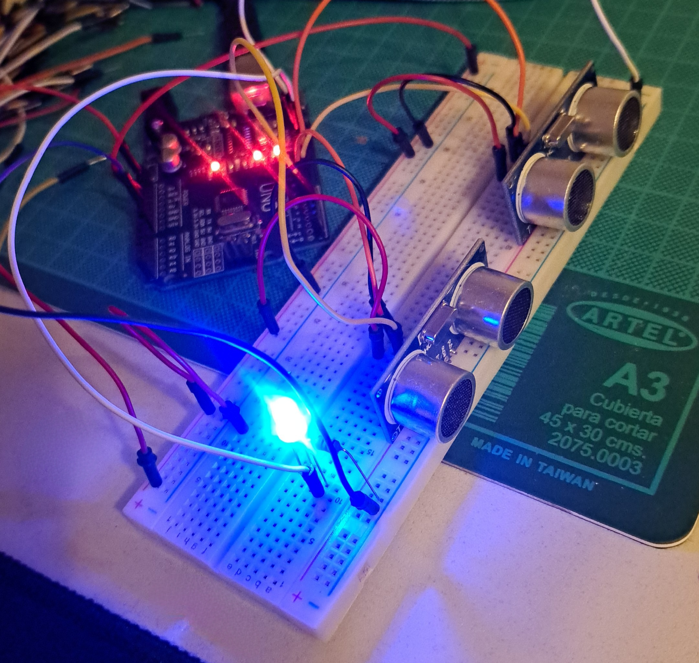
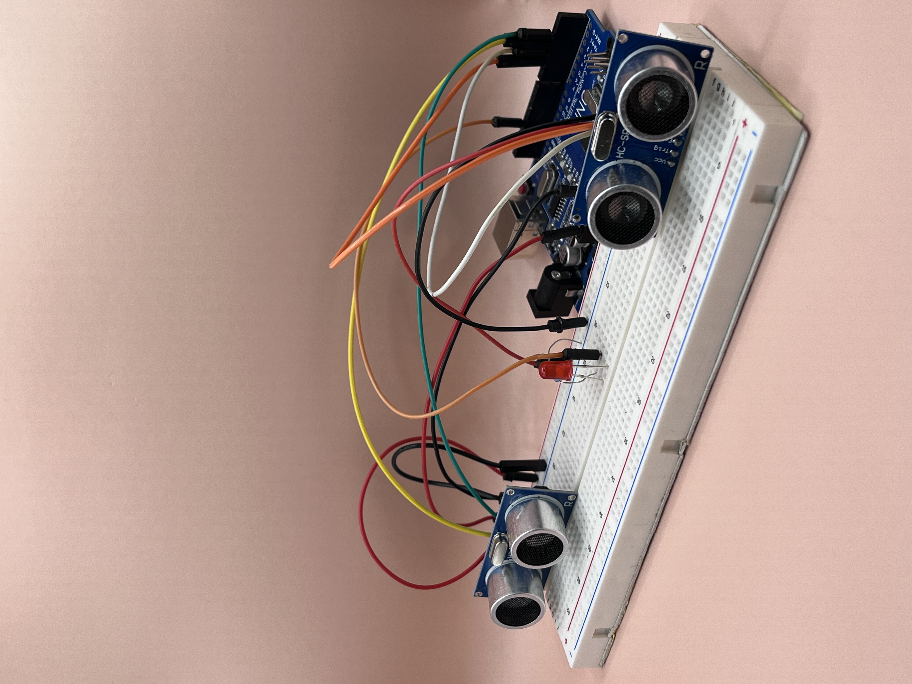

# solemne-02 grupo-07

## integrantes

* cooper manzor, valentina
* frías gonzález, aranza ignacia
* huerta galdames, sofía paz

## descripción

Este proyecto se inicia con el objetivo de mejorar la eficiencia y precisión en el conteo de personas que utilizan los torniquetes en la biblioteca de la Facultad de Arquitectura, Arte y Diseño de la Universidad Diego Portales. La biblioteca ya contaba con un contador de ingresos instalado en el arco de seguridad. Sin embargo, este sistema tenía una limitación: sólo registra el ingreso de personas que pasan por el torniquete de entrada, sin contabilizar  a las personas que ingresan a través del espacio de salida.

Para abordar esta limitación, se planteó la necesidad de desarrollar un dispositivo llamado EVASENSOR. Este dispositivo se diseñó para emitir una alerta lumínica cada vez que se detectara una evasión de entrada por el lugar correspondiente a la salida. El funcionamiento de EVASENSOR se basa en el uso de dos sensores ultrasónicos con un rango de proximidad limitado a 40 centímetros. Estos sensores se colocan en los extremos internos del torniquete, a una distancia de 15 centímetros del suelo.

El punto de partida de la persona que utiliza el torniquete es un factor crucial en la recopilación de datos de ingreso. Si el torniquete se utiliza correctamente, es decir, para salir, EVASENSOR no registrará ningún dato, ya que el uso es adecuado. Sin embargo, si lx usuarix intenta ingresar por la salida, EVASENSOR detectará esta evasión y emitirá una señal lumínica de alerta, indicando que el torniquete se está utilizando de manera incorrecta.

Este sistema mejorado contribuye a una gestión más eficiente y segura del acceso al recinto.

## imágenes






## código

```cpp
// REFERENCIAS LED y sensores
// https://soloarduino.blogspot.com/2015/08/sensor-de-distancia-usando-hc-sr04-y.html
// http://www.electronicapty.com/component/k2/item/5-sensor-ultrasonico-de-distancia-hc-sr04/5-sensor-ultrasonico-de-distancia-hc-sr04 
// https://techmake.com/blogs/tutoriales/empezando-con-arduino-3c-sensor-ultrasonico-hc-sr04 
// https://hetpro-store.com/TUTORIALES/sensor-hc-sr04/ 
// https://proveedoracano.com/blog/?p=558 
// https://forum.arduino.cc/t/dos-o-mas-sensores-de-ultrasonido-juntos/332113 

#define TRIG_PINFUERA 2
#define ECHO_PINFUERA 3
#define TRIG_PINDENTRO 4
#define ECHO_PINDENTRO 5

#define LED_PIN 13

int umbral = 30;

long duracionFuera, distanciaFuera;
long duracionDentro, distanciaDentro;

float factorConversion = 29.1;

long deltaTiempo = 5000;

long tiempoInicial = -1;

bool empezar = false;

void setup() {
  Serial.begin(9600);
  pinMode(TRIG_PINFUERA, OUTPUT);
  pinMode(ECHO_PINFUERA, INPUT);
  pinMode(TRIG_PINDENTRO, OUTPUT);
  pinMode(ECHO_PINDENTRO, INPUT);
}

void loop() {

  // lectura fuera
  digitalWrite(TRIG_PINFUERA, LOW);
  delayMicroseconds(2);
  digitalWrite(TRIG_PINFUERA, HIGH);
  delayMicroseconds(10);
  digitalWrite(TRIG_PINFUERA, LOW);

  duracionFuera = pulseIn(ECHO_PINFUERA, HIGH);
  distanciaFuera = (duracionFuera / 2) / factorConversion;

  // lectura dentro
  digitalWrite(TRIG_PINDENTRO, LOW);
  delayMicroseconds(2);
  digitalWrite(TRIG_PINDENTRO, HIGH);
  delayMicroseconds(10);
  digitalWrite(TRIG_PINDENTRO, LOW);

  duracionDentro = pulseIn(ECHO_PINDENTRO, HIGH);
  distanciaDentro = (duracionDentro / 2) / factorConversion;

  // Verificar si el sensor se activo o no
  bool sensorFueraActivo = (distanciaFuera < umbral);
  bool sensorDentroActivo = (distanciaDentro < umbral); 

  // queremos detectar si primero se activa el de fuera, y luego el de adentro, con una diferencia de tiempo
  // sensar cuando el de fuera esta activo Y el de dentro NO esta activo
  if (sensorFueraActivo && !empezar) {
    Serial.println("saliendo");
    // aqui empezo la deteccion
    empezar = true;
    tiempoInicial = millis();
  }

  // si el evento empezo
  if (empezar) {
    Serial.println("saliendo");
    // y ha pasado menos tiempo del que queremos
    if (millis() - tiempoInicial < deltaTiempo) {
      // comprobar si ahora los sensores estan invertidos
      if (sensorDentroActivo) {
        Serial.println("alerta de intruso");
        empezar = false;
      }
    }
    // en otro caso
    else {
      // resetear
      empezar = false; 
    }
     if (sensorDentroActivo) {
    empezar = false;
    // enciende el led
    digitalWrite(13, HIGH);
    delay(5000);
    // apaga el led
    digitalWrite(13, LOW);
  }
  }

  delay(100);
}
```